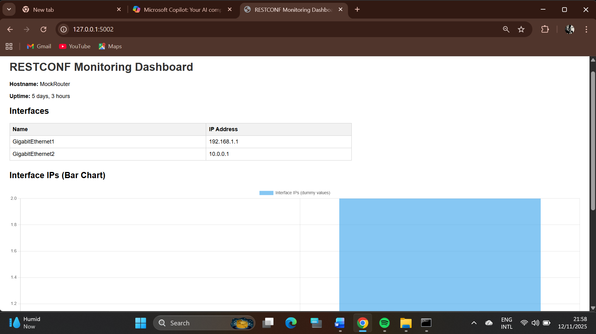
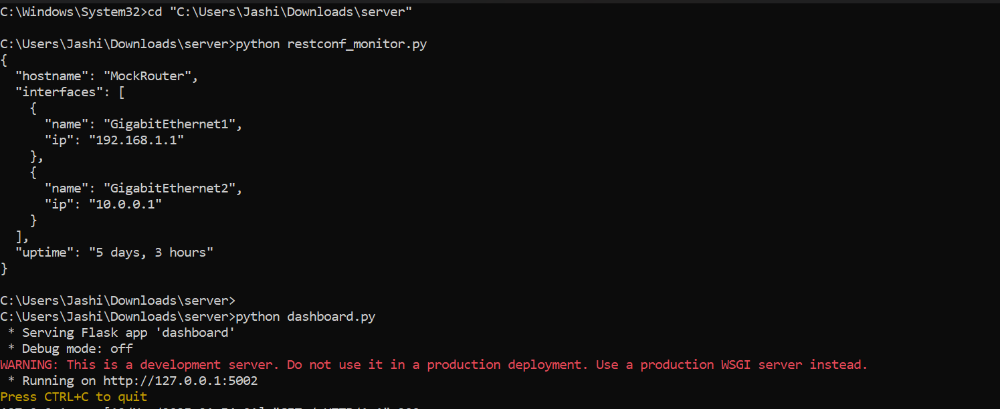

# 🚀 RESTCONF Device Monitoring Dashboard

This project automates the retrieval of device information from a Cisco IOS-XE-like RESTCONF API using Python. It includes:

- A mock RESTCONF server built with Flask
- A Python script using `requests` to fetch hostname, interfaces, and uptime
- Exception handling for authentication and connection errors
- A Flask dashboard with auto-refresh and Chart.js visualization

---

## 📸 Screenshots

### Dashboard Overview  


### JSON Output from Script  



##  Features

- RESTCONF-based data retrieval
- JSON output format
- Exception handling for real-world errors
- Auto-refreshing web dashboard
- Interface chart visualization with Chart.js

---

##  How to Run

### 1. Start the Mock RESTCONF Server

```bash
python mock_restconf.py

python restconf_monitor.py

python dashboard.py
````
Then visit http://127.0.0.1:5002 in your browser.

 Requirements
Python 3.x

Flask

requests

Install dependencies:
````
pip install flask requests
````
Project Structure
restconf-automation/
├── mock_restconf.py
├── restconf_monitor.py
├── dashboard.py
├── templates/
│   └── dashboard.html
├── images/
│   ├── dashboard.png
│   └── json_output.png
└── README.md


